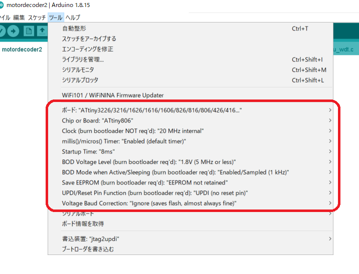

# ATtiny1606 / ATtiny806 DCC Decoder Firmware for Arduino IDE

NMRA規格の信号を受信して動作する、DCCデコーダーのファームウェアです。

[ATtiny1606 / ATtiny806 DCC Decoder Firmware](https://github.com/ytsurui/dcc-decoder2-firmware)を、Arduino IDEでビルド・書き込みできるようにディレクトリ構造の変更や、一部ファイルに変更を加えています。

---

## 対応しているマイコン

このリポジトリには、2種類のスケッチが含まれています。
 必要に応じて使い分けてください。

<table>
  <tr>
    <th>マイコン名</th>
    <th>対応しているスケッチ</th>
  </tr>
  <tr>
    <td><a href="https://www.microchip.com/wwwproducts/en/ATtiny1606">ATtiny1606</a></td>
    <td>motordecoder2</td>
  </tr>
  <tr>
    <td><a href="https://www.microchip.com/wwwproducts/en/ATtiny806">ATtiny806</a></td>
    <td>funcdecoder2</td>
  </tr>
</table>

Arduinoのビルドシステムを利用しておりますが、元々Microchip Studioで作成したコードをベースにビルドしている関係上、Arduinoのライブラリは一切使わずにCPUのレジスタを直接操作しているため、上記以外のマイコンは動作対象外となります。
 なお、ハードウェア的に近い仕様である、AVR-0 / AVR-1 / AVR-2の各シリーズでは必要な修正を施したり、マイコンの選択を正しいものにすることで動作する可能性があります。

---

## 書き込みを行うための設定

### Arduinoへのボード情報の追加

ATtiny1606 / ATtiny806にArduino IDEから書き込みができるようにするため、最初にボード情報を追加する必要があります。

https://github.com/SpenceKonde/megaTinyCore

megaTinyCoreをArduinoのボードマネージャに追加し、ビルドを行えるようにします。

### ボードの設定

設定が下記のようになるように変更します。

<table>
  <tr>
    <th>設定名</th>
    <th>設定内容</th>
  </tr>
  <tr>
    <td>ボード</td>
    <td>ATtiny3226/3216/1626/1616/1606/826/816/806/426/416/406 (ツール -> ボード -> megaTinyCore)</td>
  </tr>
  <tr>
    <td>Chip or Board</td>
    <td>ATtiny1606 (motordecoder2の場合) ATtiny806 (funcdecoder2の場合)</td>
  </tr>
  <tr>
    <td>Clock</td>
    <td>20MHz internal</td>
  </tr>
  <tr>
    <td>millis()/micros() Timer</td>
    <td>Enabled (default timer)</td>
  </tr>
  <tr>
    <td>Startup Time</td>
    <td>8ms 64ms ※どちらでも動きます。</td>
  </tr>
  <tr>
    <td>BOD Voltage Level</td>
    <td>1.8V (5 MHz or less)</td>
  </tr>
  <tr>
    <td>BOD Mode when Active/Sleeping</td>
    <td>Enabled/Sampled (1 kHz)</td>
  </td>
  <tr>
    <td>Save EEPROM</td>
    <td>EEPROM not retained</td>
  </tr>
  <tr>
    <td>UPDI/Reset Pin Function</td>
    <td>UPDI (no reset pin)</td>
  </tr>
  <tr>
    <td>Voltage Baud Correction</td>
    <td>Ignore (saves flash, almost always fine)</td>
  </tr>
</table>

下記画像と同じようになれば、正しく設定されています。

### マイコンへの書き込み方法

市販されているUPDIに対応したマイコンライター(Microchip PICKIT4)や、[jtag2updi](https://github.com/ElTangas/jtag2updi)を使用して書き込みを行ってください。