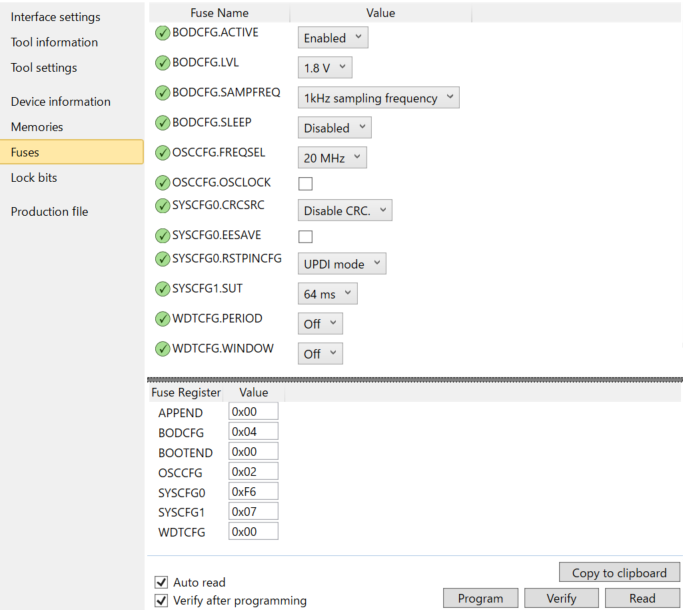

## AVR Fuse Bitの設定内容

BODを有効にするため、下記の内容を書きます。
 (表記はAtmel Studioのものとなります)

  * APPEND: 0x00
  * BODCFG: 0x04
  * BOOTEND: 0x00
  * OSCCFG: 0x02
  * SYSCFG0: 0xF6
  * SYSCFG1: 0x07
  * WDTCFG: 0x00

Atmel Studioで設定を行う場合、「BODCFG.ACTIVE」を「Enabled」に切り替えてください。

